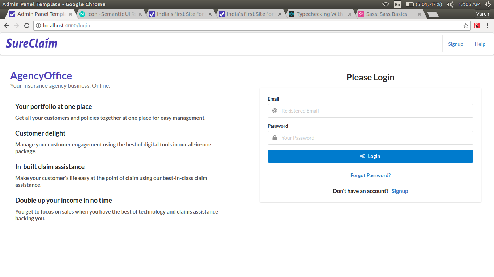
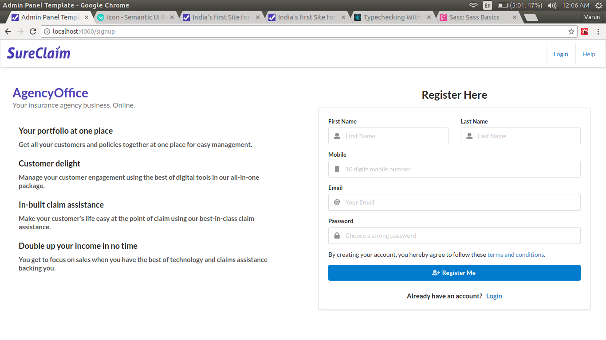
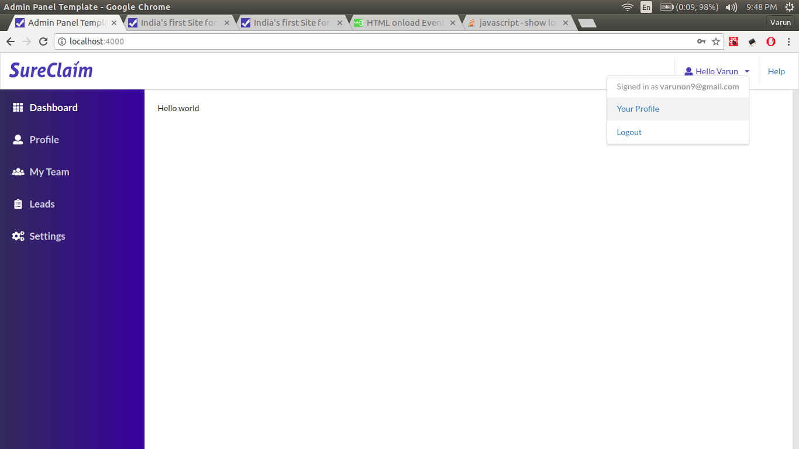
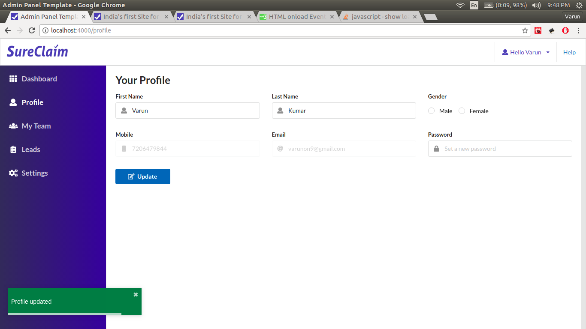

#### How to setup project instruct by Anik

1. Install node.js
2. Install mysql
3. Create database with name `admin_panel_template` and set root password `123456789` if you want to use different database name and password please change database name and passowrd form `config/config.js` as well as database 
4. Go to project directory terminal run `npm install` it will install all dependency to run this project 
5. Install nodemon if use linux  `sudo npm install -g --force nodemon` to run backend 
6. Open an Terminal and Build project by run thi command `npm run build-dev`
7. Open another terminal and run nodemon by `nodemon` to run backend 
8. If all setup is okay project will be run in `http://localhost:4000/` check it in browser
9. if project not run successfully then again from no 1 

If need any help contact `https://www.upwork.com/freelancers/~01c4dc03a059fe7fcb`

### Screenshots
|  |  |
| --- | --- |
| | |
| | |

#### How to setup project old one 

1. Clone the repo `https://github.com/varunon9/admin-panel-template-react.git`
2. Move to project folder `cd admin-panel-template-react`
3. Install dependencies `npm install`
4. Create config.js file from config-sample.js `cd config && cp config-sample.js config.js`
5. In MySql create a database "adminPanelTemplate" (or with any other name but must be mentioned in config.js)
6. Update `username` with your MySql username and `password` with your MySql password in config.js 
7. Build bundle.js `npm run build` (for development use `npm run build-dev` and keep terminal open)
8. start the project from project root directory `node bin/www` or `nodemon`
9. Visit localhost:4000 in browser
10. Use `npm run build-sass`  to transpile sass/scss files to css.

